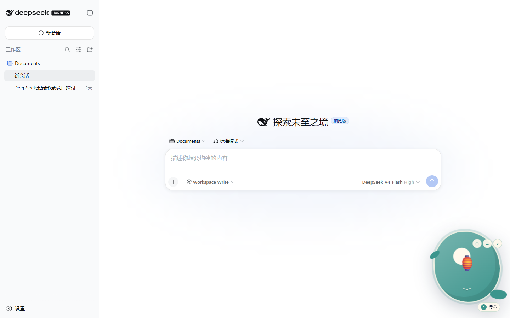
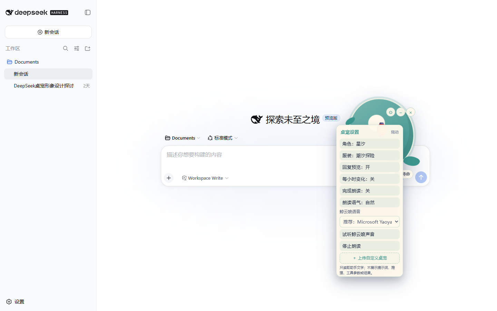

# DSH Companion Studio

English | [简体中文](README.zh-CN.md)

An early, privacy-aware desktop-companion engine for DeepSeek Harness. It is deliberately **not** another balance or cost meter. It turns official session facts into useful ambient feedback and leaves character art in independently installable packs.

> Status: public core preview. The runtime, privacy boundary, state machine, pack schema and bundle manifest are testable. No character art is bundled, and npm publishing remains disabled while real-profile QA continues.

## Preview



The companion is enabled in a real local DSH profile. Its state is visible at the lower right, while the composer shows the active workspace permission, model and mode.



The settings panel is draggable and exposes reply preview, hourly variation, local speech controls, voice selection and local pet upload. The screenshots use the art-free built-in placeholder; independently licensed character packs are installed separately.

## What is different

- Eight explicit states: idle, thinking, streaming, tool use, waiting for the user, success, error and sleep.
- A compact live bubble containing **assistant text only**. Reasoning, prompts, tool arguments and tool results are never selected.
- Credential-like strings are redacted before display. Preview can be disabled separately.
- Completion can be read with the browser's local Web Speech API. It is off by default, sends no audio or text to a voice service, and can be stopped immediately from the pet menu.
- Optional hourly variation rotates the selected character's outfit and plays a short showcase motion. It is off by default.
- The voice menu auto-ranks installed Mandarin voices, allows an explicit local choice and includes a short audition line.
- Shown, docked and completely hidden modes. A session-header button restores a fully hidden pet.
- Character and outfit selection is data-driven. External character plugins can register before or after the core.
- A user can upload one local PNG/WebP and use it immediately as a private pet. The image is normalized locally, stored in IndexedDB and restored after reload.
- `prefers-reduced-motion` is respected.

## Bundled demo metadata

The public core includes one art-free metadata placeholder, **星汐 / 星潮鲸灵**, so the picker and outfit settings remain testable. It intentionally renders as a glyph until a user uploads a local image or installs a separately licensed character pack. No whale-maid or third-party character images are distributed by this repository.

## Pack model

The core package stays small. A separately installed DSH client plugin can import `registerCompanionPack` from `dsh-companion-studio/client-api` and register one manifest. Each manifest binds its license, palette, outfits and optional animation sprite sheets. The global Symbol registry handles either load order and returns a disposer for hot reload.

See [docs/PACK-SPEC.md](docs/PACK-SPEC.md) for the v1 contract and animation requirements.

## User-created pets

The settings panel accepts a single PNG or WebP up to 5 MB and 2048×2048 / 4.19 million pixels. DSH decodes and re-encodes it as a static PNG, preserving transparency while removing metadata and animated payloads. SVG, HTML, remote URLs and arbitrary scripts are not accepted. The resulting Blob lives only in the browser's IndexedDB; an object URL exists only while the plugin is mounted and is revoked on deletion or unload.

One image receives the core's eight lightweight CSS motions, so a user does not need a sprite sheet. Advanced per-state art remains the explicit pack path. Background removal is not claimed: users should upload transparent art for the cleanest result.

## Privacy boundary

The reply bubble reads the official `ConversationSnapshot.partial` and finalized assistant nodes. It accepts only blocks whose kind is `text`. The following never enter preview or speech:

- user prompts or injected context;
- reasoning blocks;
- tool names, arguments or results;
- approval/question payloads;
- telemetry, balances or model pricing.

The preview is capped and sanitized again before local speech. Speech is opt-in.

## Development

```bash
# Node.js 22.19 or newer
pnpm install
pnpm check
pnpm pack --dry-run
```

For local evaluation after building:

```bash
dsh plugin --profile web add link:/absolute/path/to/dsh-companion-studio
```

The included `cordis.patch.yml` uses DSH's profile-bundle patch mechanism. This is a source preview rather than a published npm package.

## Public-repository boundary

- MIT covers the source code in this repository.
- No character artwork is included in the repository or package files.
- User-uploaded pets stay in that user's browser.
- External pack authors are responsible for declaring compatible licenses and keeping provenance records.

See [docs/ASSET-PROVENANCE.md](docs/ASSET-PROVENANCE.md) and [SECURITY.md](SECURITY.md).

## Near-term gates

1. Validate streaming, tool, waiting, error and completion transitions in a real DSH profile.
2. Validate drag persistence, full hide/restore and Chinese/English local voices.
3. Build one independently licensed external pack to prove install/uninstall and load-order behavior.
4. Complete in-app visual QA with both a local upload and an external pack.
5. Only then remove `private: true`, publish to npm and submit to community directories.
